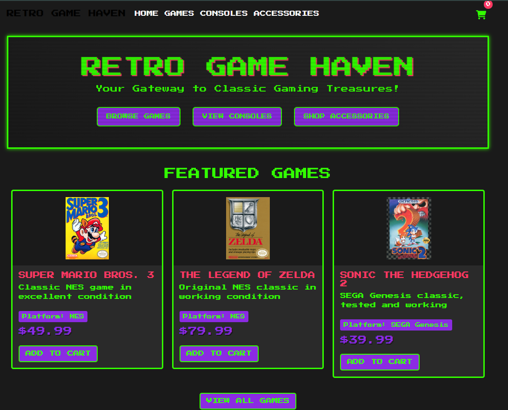
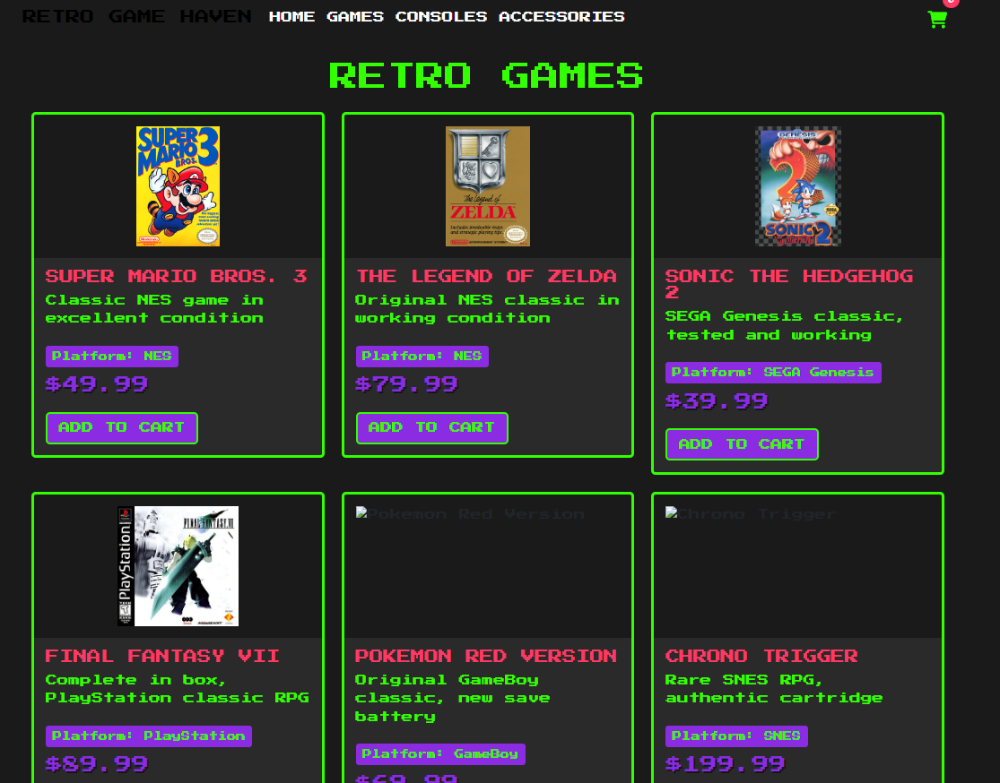
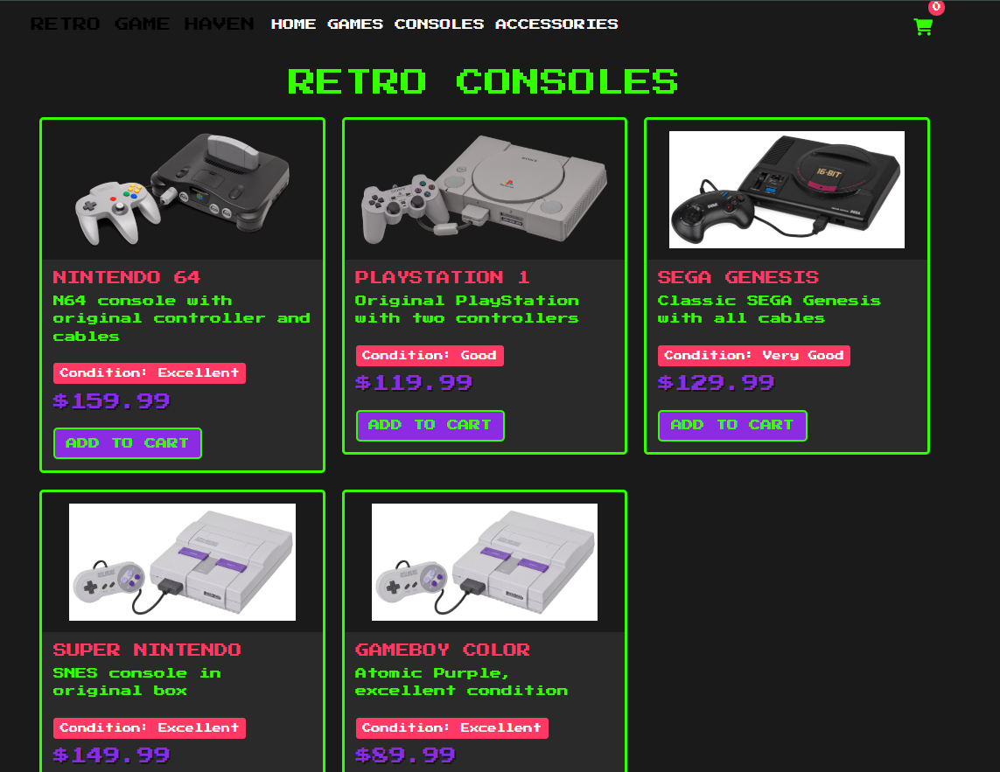
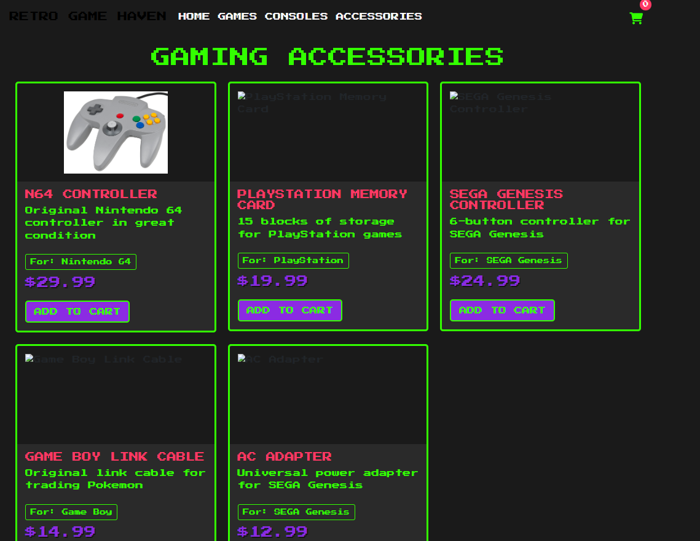
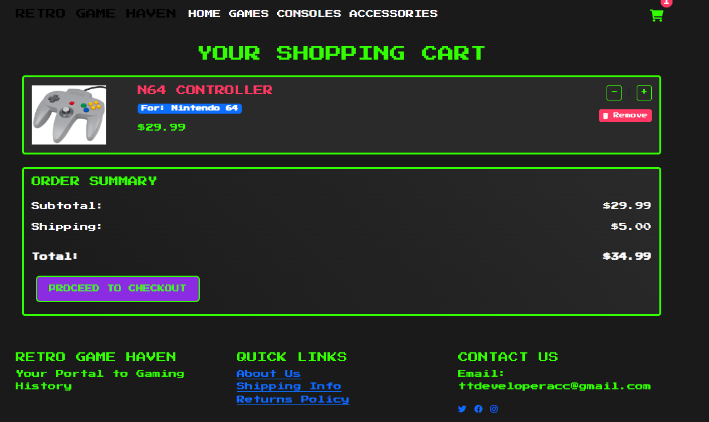

# E-commerce Website

A remade e-commerce website built with Flask and Stripe integration.

This was a personal project back in the e'old days and it is remade now for anyone to use and learning purposes.

## Setup Instructions

1. Create a virtual environment:
```bash
python -m venv venv
source venv/bin/activate  # On Windows: venv\Scripts\activate
```

2. Install dependencies:
```bash
pip install -r requirements.txt
```

3. Create a `.env` file in the root directory and add your configuration:
```
FLASK_APP=app.py
FLASK_ENV=development
STRIPE_SECRET_KEY=your_stripe_secret_key
STRIPE_PUBLISHABLE_KEY=your_stripe_publishable_key
DATABASE_URL=your_database_url
```

4. Run the application:
```bash
flask run
```

## Features
- Product catalog with categories
- Shopping cart functionality
- User authentication
- Stripe payment integration
- Database integration ready
- Responsive design

## Retro Game Haven - Screenshots

### Homepage

*Your Gateway to Classic Gaming Treasures! Browse through our collection of retro games, consoles, and accessories.*

### Retro Games Collection

*Featured classics including Super Mario Bros. 3, The Legend of Zelda, Sonic the Hedgehog 2, Final Fantasy VII, and more.*

### Retro Consoles

*Original gaming systems in excellent condition, including Nintendo 64, PlayStation 1, SEGA Genesis, Super Nintendo, and GameBoy Color.*

### Gaming Accessories

*Essential gaming accessories including controllers, memory cards, link cables, and power adapters.*

### Shopping Cart

*User-friendly shopping cart with clear order summary and secure checkout process.*

## Additional Features
- Retro-styled UI design with classic gaming aesthetics
- Detailed product descriptions and condition ratings
- Secure payment processing
- Multiple gaming platforms supported
- Original and authentic gaming hardware and software
- Categorized browsing experience
- Real-time cart updates
- Shipping calculation
- Mobile-responsive design
